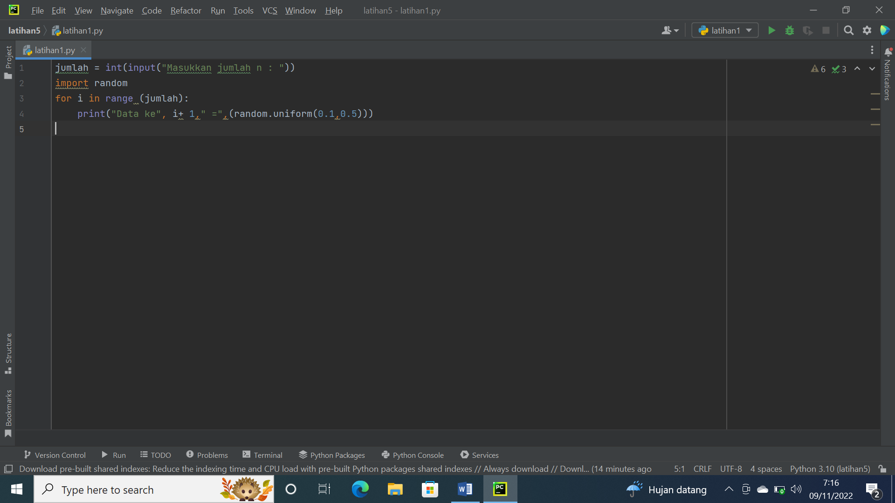
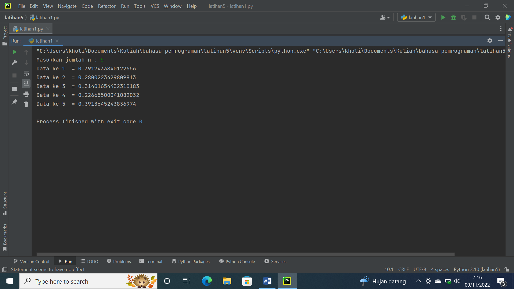
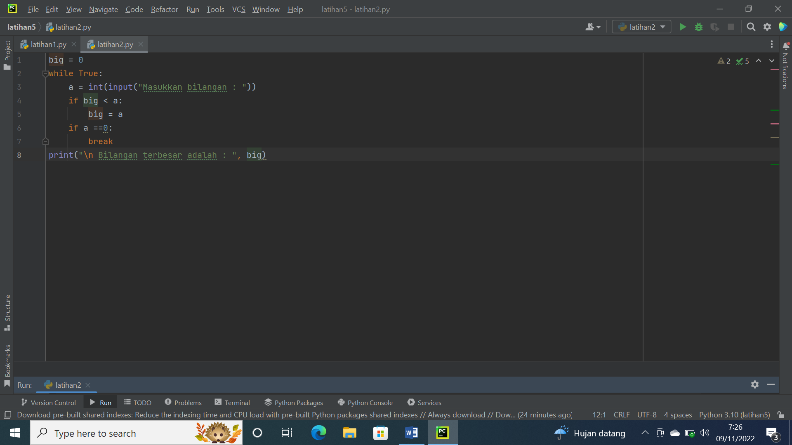
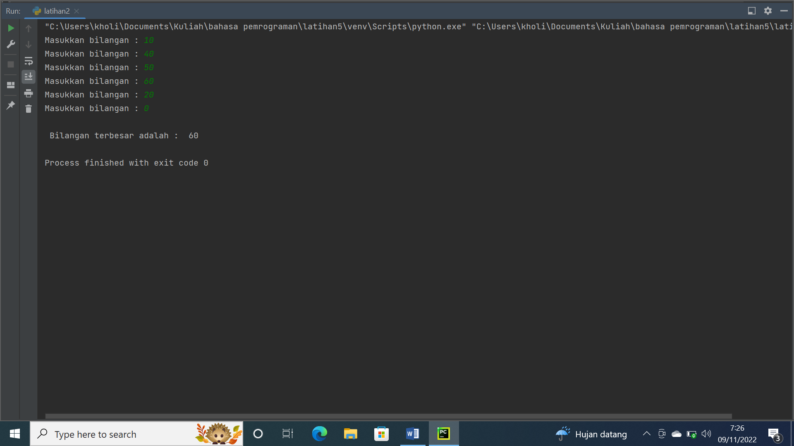
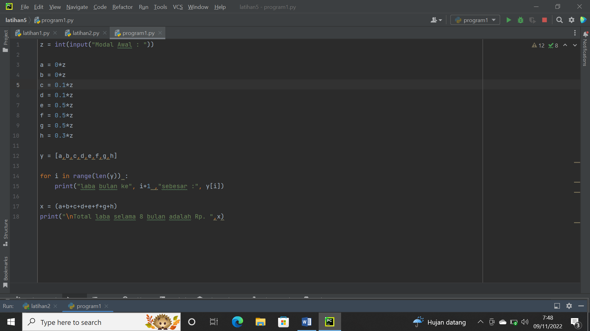
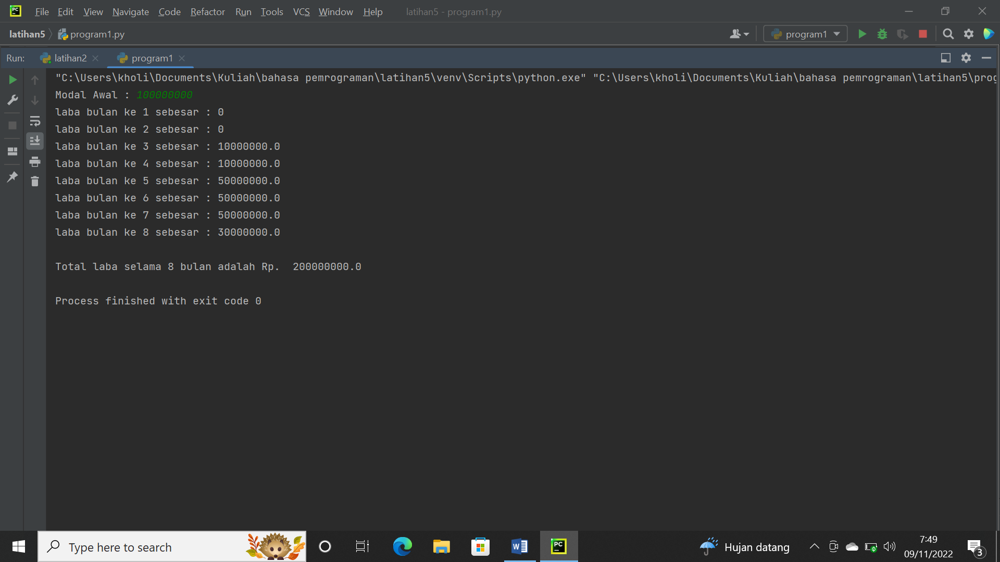

# latihan 1
---
## Menunjukan **n** bilangan acak yang lebih kecil dari 0.5
### langkah-langkah

1. ketik program 
*jumlah=int(input("Masukan jumlah n"))*
1. ketik program *import ramdom*
1. Program ketik untuk i in range (jumlah):
1. program ketik print("Data ke-", 1+i"="(random.uniform(0.1,0.5)))
### Hasil

1. masukkan nilai (n) : 5
1. program akan mencetak data ke 1 sampai 5 dengan nilai kurang dari 0.5
## **Pejelasan**
1. jumlah=int(input("Masukkan jumlah n")) Untuk menentukan jumlah input yang di inginkan sesuai tipe data, yaitu interger tipe data bilangan bulat.
1. import random
1. for i in range (jumlah): Untuk pengulangan dengan range jumlah.
1. print("Data ke",1+i"=",(random.uniform(0.1,0.5))) Untuk menampilkan atau mencetak urutan data sesai jumlah inputan dengan hasil dibawah 0.5.
# Latihan 2
---
## Angka terbesar dari *n* buah data yang diinputkan dan masukkan angka 0 untuk berhenti.
### langkah-langkah

1. Ketik Program print ('Menampilkan Bilangan Terbesar Dari N Buah Data Yang Diinputkan')
1. Ketik Program max= 0
1. Ketik Program while true:
1. Ketik Program a=int(input("Masukan Bilangan :"))
1. Ketik Program if max < a
1. Ketik Program max=a
1. Ketik Program if a==0:
1. Ketik Program break
1. Ketik Program print("Bilangan Tebesar Adalah :", max
### Hasil

## penjelasan 
1. print ('Menampilkan Bilangan Terbesar Dari N Buah Data Yang Diinputkan') Untuk menampilkan kalimat Menampilkan Bilangan Terbesar Dari N Buah Data Yang Diinputkan
1. max= 0 kode max disini untuk menentukan nilai max nya dalah 0
1. while true: Untuk perulangan hingga waktu yang tidak di tentukan atau selamanya
1. a=int(input("Masukan Bilangan :")) a untuk menginput tipe data interger ( bilangan bulat )
1. if max < a max=a jika max kurang dari a maka max = a
1. if a==0: break jika a= 0 maka akan berhenti dengan syarat break yang terpenuhi
1. print("Bilangan Tebesar Adalah :", max) Menampilkan *Bilangan Tebesar Adalah : Nilai maxiumnya.
# program 1
---
## menghitung jumlah laba hasil investasi seorang pengusaha selama 8 bulan
Seorang pengusaha menginvestasikan uangnya untuk memulai usahanya dengan modal awal 100 juta, pada bulan pertama dan kedua belum mendapatkan laba. pada bulan ketiga baru mulai mendapatkan laba sebesar 1% dan pada bulan ke 5, pendapatan meningkat 5%, selanjutnya pada bulan ke 8 mengalami penurunan keuntungan sebesar 2%, sehingga laba menjadi 3%. Hitung total keuntungan selama 8 bulan berjalan usahanya.

### langkah-langkah

1. Ketikan Program print ('Jumlah Laba Hasil Investasi Seorang Pengusaha Selama 8 Bulan')
1. Ketik Program x=100000000
1. Ketik Program print (" Modal Awal:",x)
1. Ketik Program a=0x, b=0x, c=0.01x, d=0.01x, e=0.05x, f=0.05x, g=0.05x, h=0.03x
1. Ketik Program y=[a,b,c,d,e,f,g,h]
1. Ketik Program For i in range (len (y))
1. Ketik Program Print (“laba bulan ke-“,i+1,”sebesar:” ,y[i])
1. Ketik Program Z= (a+b+c+d+e+f+g+h)
1. Ketik Program Print (“jumlah laba selama 8 bulan adalah:”)
### Hasil

### penjelasan 
1. print ('Jumlah Laba Hasil Investasi Seorang Pengusaha Selama 8 Bulan') Untuk Menampilkan kalimat Jumlah Laba Hasil Investasi Seorang Pengusaha Selama 8 Bulan
1. z=100000000 Dengan pemisalan atau dideklarasikan z adalah 100000000
1. print (" Modal Awal:",z) Menampilkan kalimat Modal Awal : dan data yang berisi di z yaitu 100000000
1. a=0x, b=0x, c=0.01x, d=0.01x, e=0.05x, f=0.05x, g=0.05x, h=0.03x Untuk Mendeklarasikan presentase laba tiap bulan dan di kali dengan z atau data inputan modal investasi yaitu 100000000
1. y=[a,b,c,d,e,f,g,h] untuk menentukan syarat y= yang berisi a,b,c,d,e,f,g,h
1. For i in range (len (y)) Print (“laba bulan ke-“,i+1,”sebesar:” ,y[i]) untuk perulangan data dengan isi data yaitu Y dengan menampilkan urutan laba perbulan sesuai range yang di tentukan dengan hasil ke untukan yang di inpput dari data Y
1. x= (a+b+c+d+e+f+g+h) Print (“jumlah laba selama 8 bulan adalah:”) x berisi data penjumlahan data angka yang ada didalam kode a,b,c,d,e,f,g,h yang akan di tampilakan atau dicetak di jumlah laba selama 8 bulan

# **TERIMAKASIH**
